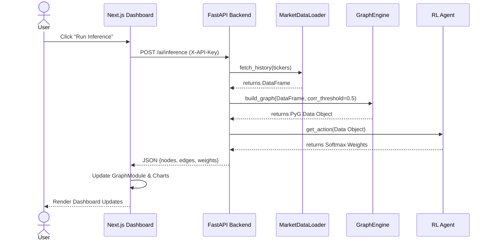
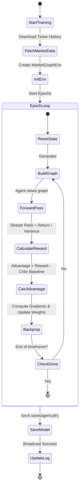
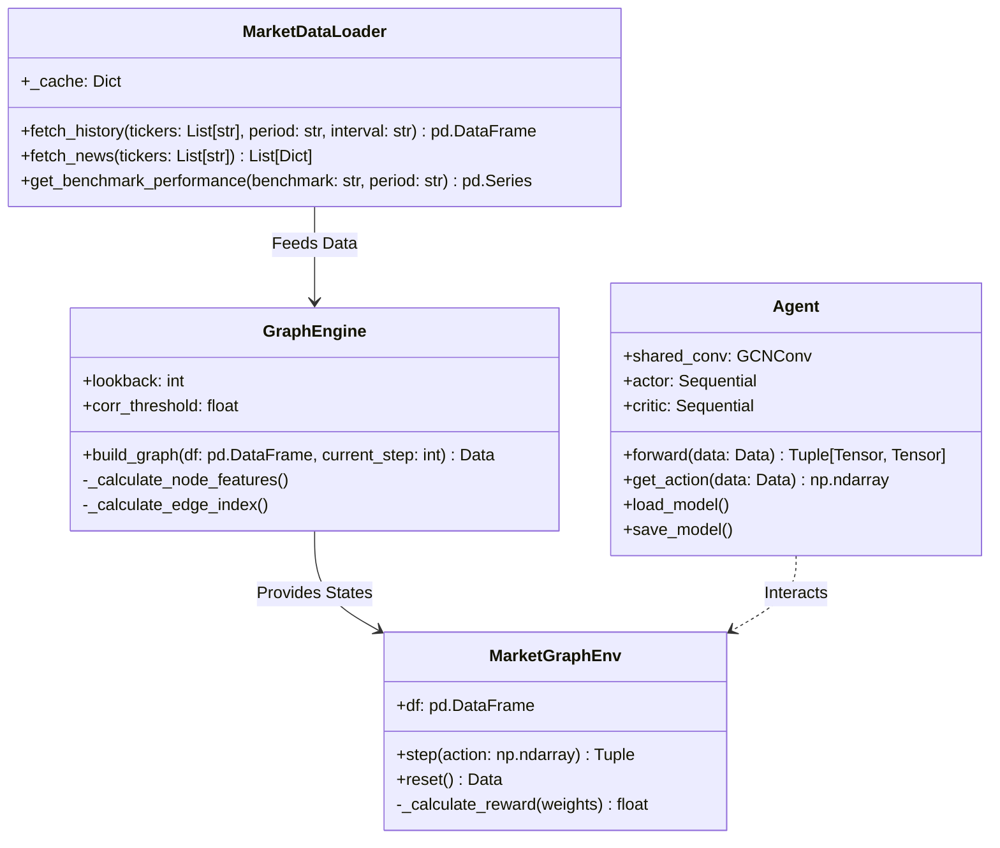
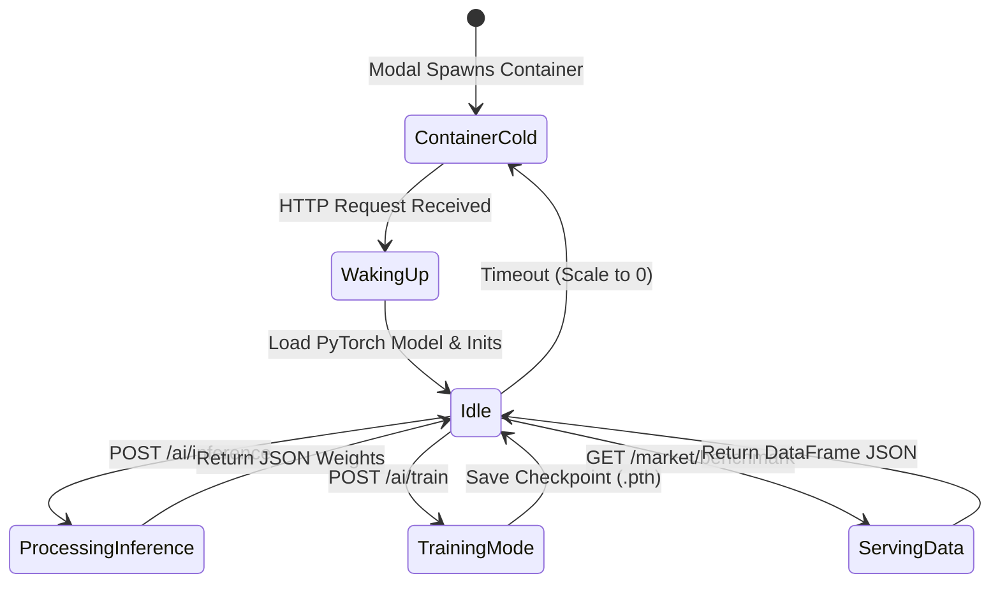

# CGPO UML Diagrams (Mermaid)

Copy and paste these blocks into [Mermaid Live](https://mermaid.live) to generate the diagrams for your Blackbook.

## 1. Deployment Diagram
Shows the physical cloud infrastructure: User Browser → Vercel CDN → Modal GPU.

```mermaid
flowchart TD
    subgraph Client ["Client Tier"]
        B[User Browser\n(Web Client)]
    end

    subgraph Vercel ["Vercel Edge Network"]
        UI[Next.js Frontend Dashboard]
        API_Route[Next.js API Routes]
    end

    subgraph Modal ["Modal Cloud GPU Infrastructure"]
        direction TB
        subgraph Container ["Debian Linux Container (T4 GPU)"]
            FASTAPI[FastAPI Server\nmain.py]
            PyG[Graph Engine\nPyTorch Geometric]
            Agent[RL Agent Model\nPyTorch]
        end
    end

    subgraph External ["External Services"]
        YF[Yahoo Finance API\n(Market Data)]
    end

    B -- HTTPS --> UI
    UI -- HTTPS (X-API-Key) --> FASTAPI
    FASTAPI -- Internal Logic --> PyG
    FASTAPI -- Inference --> Agent
    FASTAPI -- HTTP REST --> YF
```

## 2. Component Diagram
Shows the modular structure of your React frontend and Python backend.

```mermaid
flowchart LR
    subgraph Frontend ["Next.js Frontend (React)"]
        LP[Landing Page\npage.tsx]
        DB[Dashboard\n/dashboard/page.tsx]
        SB[Sidebar.tsx]
        GM[GraphModule.tsx]
        CC[ComparisonChart.tsx]
        API_Lib[Fetch Wrapper\napi.ts]
        
        LP --> DB
        DB --> SB
        DB --> GM
        DB --> CC
        DB -.-> API_Lib
    end

    subgraph Backend ["FastAPI Backend (Python)"]
        API[main.py\nRouting & Security]
        DL[data_loader.py\nMarketDataLoader]
        GE[graph_engine.py\nGraphEngine]
        AG[agent.py\nAgent A2C]
        ENV[market_env.py\nMarketGraphEnv]
        
        API --> DL
        API --> GE
        API --> AG
        API --> ENV
    end

    API_Lib == HTTPS Requests ==> API
```



## 3. Sequence Diagram (Inference Flow)
Shows the step-by-step chronological execution when a user asks for AI allocations.



## 4. Activity Diagram (Training Loop)
Shows the logic flow inside the backend when the RL Agent is being trained in the background.



## 5. Class Diagram (Backend Core)
Shows the Object-Oriented design of your Python AI logic.



## 6. Use Case Diagram
Shows what actions the User and the API can perform in the system.

```mermaid
usecaseDiagram
    actor User as Investor
    actor ExternalSystem as Yahoo Finance System

    package "CGPO Software System" {
        usecase "Modify Portfolio Configuration" as UC1
        usecase "Run Real-time AI Inference" as UC2
        usecase "Initiate RL Agent Training" as UC3
        usecase "View Neural Graph Visualization" as UC4
        usecase "Compare Returns vs Benchmarks" as UC5
        usecase "View Live Execution Trace" as UC6
        usecase "Fetch Market Prices & News" as UC7
    }

    User --> UC1
    User --> UC2
    User --> UC3
    User --> UC4
    User --> UC5
    User --> UC6
    
    UC2 ..> UC7 : <<includes>>
    UC3 ..> UC7 : <<includes>>
    UC5 ..> UC7 : <<includes>>
    
    ExternalSystem --> UC7
```

## 7. State Machine Diagram (Backend Server States)
Shows how your Modal server handles requests and background tasks.



## 8. Package Diagram
Shows the directory isolation of your repository structure.

```mermaid
graph TD
    subgraph frontend ["Frontend Layer (Next.js)"]
        A[app/]
        C[components/]
        L[lib/api]
        A -.-> C
        C -.-> L
    end

    subgraph backend ["Backend Layer (FastAPI)"]
        API[main.py (Controllers)]
        subgraph core ["Core Logic (ML Pipeline)"]
            DL[data_loader.py]
            GE[graph_engine.py]
            AG[agent.py]
            ENV[market_env.py]
        end
        API -.-> core
    end
    
    L == X-API-Key HTTP ==> API
```
